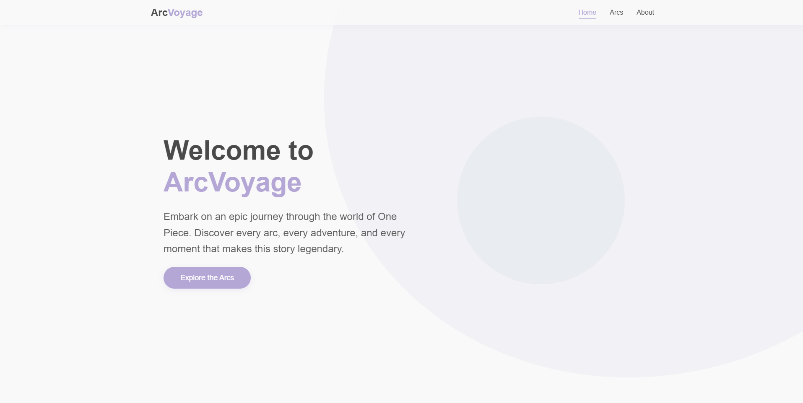
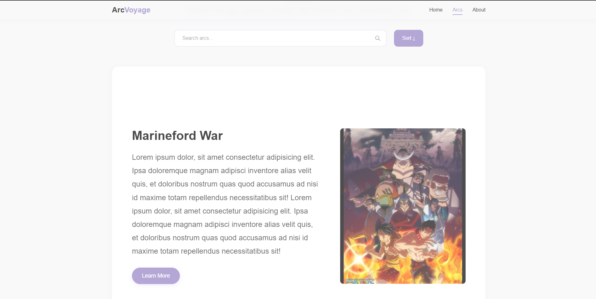

# ArcVoyage

A comprehensive Single Page Application (SPA) guide to One Piece story arcs, built with vanilla JavaScript, modern CSS, and HTML5.

## Overview

ArcVoyage is an interactive web application that serves as a guide to the One Piece anime/manga series story arcs. Built as a Single Page Application, it provides seamless navigation and exploration of the various story arcs in the One Piece universe.

### Home Page

### Arcs Page

## Features

- **Arc Exploration**: Browse through One Piece story arcs with a clean, intuitive interface
- **Search & Sort**: Easily find specific arcs with real-time search and sorting capabilities
- **Detailed Information**: View comprehensive details about each arc including:
  - Key events
  - Major characters
  - Episode/chapter ranges
  - Story summaries
- **Responsive Design**: Fully responsive layout that works on all devices
- **Performance Optimized**: Fast loading with local storage caching
- **Accessibility**: ARIA labels and semantic HTML for better accessibility

## Technical Implementation

### Architecture
- Single Page Application (SPA)
- Client-side routing
- State management
- Component-based structure

### Technologies
- **JavaScript**: Pure vanilla JS (ES6+)
- **CSS3**: Modern styling with animations
- **HTML5**: Semantic markup
- **Local Storage**: Client-side data persistence

### Project Structure